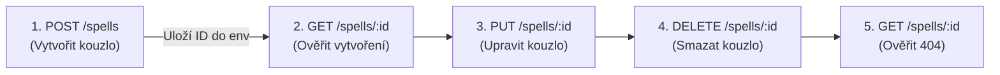

# 🧪 PotterAPI – Testovací scénáře, tipy a rady pro Bruno API Client

Tento dokument obsahuje přehled testovacích scénářů, tipů, triků a automatizovaných testů v aplikaci **Bruno** pro testování REST API **PotterAPI**.

### 📋 Stručné shrnutí toho, co v dokumentu najdete:

  1. Spouštění aplikace (Backend & Frontend):
      • Spuštění backend serveru na portu 3000.
      • Spuštění frontend aplikace.
  2. Nastavení prostředí (Environment v Bruno):
      • Nastavení proměnných baseUrl (http://localhost:3000), username ( ), password ( ).
  3. Testovací scénáře pro všechny API služby:

      • 🪄 Kouzla (/spells): Pozitivní testy (seznam, detail, nový záznam, úprava, smazání) a negativní testy (duplicity, chybějící Content-Type: application/json hlavička, 422 Joi
      validace, 404).
      
      • 🧙 Postavy (/characters): Testy s Basic Auth, filtrování podle koleje/role, přidávání, úprava a mazání postav, chybové stavy pro 401 Unauthorized a duplicity.
      
      • 🏰 Koleje, Klobouk a Citáty (/houses, /sortingHat, /quote): Testy pro získání kolejí a citátů.
  3. Asertace a Automatizace (Tests & Scripts):
      
      • Příklady JavaScript testů pro záložku Tests v Bruno (kontrola stavových kódů 200, 201, 400, 401, 422, kontrola JSON struktury).
      
      • Skript pro záložku Post Response v Bruno pro automatické uložení vygenerovaného ID z odpovídajícího POST požadavku do proměnné prostředí (bru.setEnvVar("createdSpellId", body.
      spell.id)).

  4. Workflow & Řetězení testů (Chaining):
     
      • Postup, jak nastavit kompletní CRUD cyklus: POST ➡️ GET detail ➡️ PUT ➡️ DELETE ➡️ GET 404.
---

## 🚀 Spouštění aplikace

Před spuštěním testů je nutné spustit backend server a případně i frontend aplikaci.

### Backend (API Server)

Backend je Express.js aplikace běžící na portu **3000**.

**Spuštění z kořenové složky projektu:**
```bash
cd web/backend
npm install   # Nainstaluje závislosti (pokud ještě nejsou nainstalovány)
npm start    # Spustí server pomocí nodemon (automaticky restartuje při změnách)
```

**Přímé spuštění bez nodemon:**
```bash
cd web/backend
node app.js
```

Server bude dostupný na `http://localhost:3000`.

> [!TIP]
> Pokud je port 3000 obsazen, je nutné jej uvolnit nebo změnit port přímo v souboru `web/backend/app.js` (řádek 9: `const port = 3000`).

### Frontend (Vue.js Aplikace)

Frontend je Vue.js aplikace, kterou lze spustit pro vývojové účely.

**Spuštění z kořenové složky projektu:**
```bash
cd web/frontend
npm install   # Nainstaluje závislosti (pokud ještě nejsou nainstalovány)
npm run serve # Spustí vývojový server (obvykle na portu 8080)
# nebo
npm start     # Stejné jako npm run serve
```

Frontend bude dostupný na `http://localhost:8080`.

> [!NOTE]
> Pro samotné testování API pomocí Bruno není spuštění frontend nutné. Stačí mít běžící backend server.

---

## ⚙️ 1. Nastavení Bruno (Environment & Kolekce)

### Vytvoření prostředí (Environment)
V aplikaci Bruno si vytvořte nové prostředí (např. `Local`) s následujícími proměnnými:

| Název proměnné | Hodnota | Popis |
| :--- | :--- | :--- |
| `baseUrl` | `http://localhost:3000` | Základní URL lokálního serveru |
| `username` | `*****` | Přihlašovací jméno pro Basic Auth |
| `password` | `*****` | Heslo pro Basic Auth |
| `createdSpellId` | *(dynamicky)* | Ukládá ID nově vytvořeného kouzla |
| `createdCharacterId` | *(dynamicky)* | Ukládá ID nově vytvořené postavy |

> [!TIP]
> V Bruno můžete v URL i v těle požadavku používat proměnné pomocí zápisu `{{baseUrl}}/spells`.

---

## 🔑 2. Autentizace v Bruno

Aplikace používá dva druhy autentizace:

1. **Basic Auth (`*****` / `*****`)**:
   - Vyžadováno pro **`/characters`** a **`/login`**.
   - **Nastavení v Bruno**: Na záložce **Auth** zvolte `Basic Auth` a zadejte `Username: {{username}}` a `Password: {{password}}`.

2. **Content-Type Header Check (`application/json`)**:
   - Vyžadováno pro `POST` a `PUT` u **`/spells`** (middleware `checkHeader`).
   - **Nastavení v Bruno**: Na záložce **Headers** přidejte `Content-Type: application/json`.

---

## 📋 3. Přehled testovacích scénářů

### 🪄 A. Kouzla (`/spells`)

#### 🟢 Pozitivní scénáře (Happy Path)
1. **Získání všech kouzel**
   - **Metoda:** `GET {{baseUrl}}/spells`
   - **Očekávaný stav:** `200 OK`
   - **Kontrola:** Vrátí pole objektů, kde každý objekt má `id`, `spell`, `type`, `effect`, `isUnforgivable`.

2. **Filtrování kouzel podle typu**
   - **Metoda:** `GET {{baseUrl}}/spells?type=Curse`
   - **Očekávaný stav:** `200 OK`
   - **Kontrola:** Každá položka v poli má `"type": "Curse"`.

3. **Vytvoření nového kouzla**
   - **Metoda:** `POST {{baseUrl}}/spells`
   - **Headers:** `Content-Type: application/json`
   - **Body (JSON):**
     ```json
     {
       "spell": "Expelliarmus",
       "type": "Charm",
       "effect": "Disarms your opponent",
       "isUnforgivable": "false"
     }
     ```
   - **Očekávaný stav:** `201 Created`
   - **Kontrola:** Vrátí `{ message: "Spell created", spell: { id: "..." } }`. Hodnota `isUnforgivable` v `spells.json` bude `false` (boolean).

4. **Získání konkrétního kouzla podle ID**
   - **Metoda:** `GET {{baseUrl}}/spells/{{createdSpellId}}`
   - **Očekávaný stav:** `200 OK`
   - **Kontrola:** Vrátí objekt kouzla s odpovídajícím ID.

5. **Úprava kouzla**
   - **Metoda:** `PUT {{baseUrl}}/spells/{{createdSpellId}}`
   - **Headers:** `Content-Type: application/json`
   - **Body (JSON):**
     ```json
     {
       "spell": "Expelliarmus Maxima",
       "type": "Charm",
       "effect": "Strongly disarms opponent",
       "isUnforgivable": false
     }
     ```
   - **Očekávaný stav:** `201 Created`

6. **Smazání kouzla podle ID**
   - **Metoda:** `DELETE {{baseUrl}}/spells/{{createdSpellId}}`
   - **Očekávaný stav:** `200 OK`
   - **Kontrola:** Vrátí `{ message: "spell deleted" }`.

---

#### 🔴 Negativní a Hraniční scénáře
1. **Chybějící hlavička Content-Type (POST / PUT)**
   - **Metoda:** `POST {{baseUrl}}/spells` (bez `Content-Type: application/json`)
   - **Očekávaný stav:** `400 Bad Request`
   - **Očekávaná zpráva:** `"Sorry Nick you dont have HEADer"`

2. **Pokus o vytvoření duplicitního kouzla**
   - **Metoda:** `POST {{baseUrl}}/spells` s národem kouzla, které již existuje (např. `"spell": "Alohomora"`)
   - **Očekávaný stav:** `400 Bad Request`
   - **Očekávaná zpráva:** `"Spell Alohomora already exists"`

3. **Neplatná data (Joi validation failure)**
   - **Metoda:** `POST {{baseUrl}}/spells`
   - **Body (JSON):** (příliš krátký název, neplatný typ)
     ```json
     {
       "spell": "Ab",
       "type": "SuperPower",
       "isUnforgivable": true
     }
     ```
   - **Očekávaný stav:** `422 Unprocessable Entity`

4. **Vyhledání neexistujícího kouzla**
   - **Metoda:** `GET {{baseUrl}}/spells/non-existing-id-999`
   - **Očekávaný stav:** `404 Not Found`

---

### 🧙 B. Postavy (`/characters`)

> [!IMPORTANT]
> Všechny požadavky na `/characters` vyžadují **Basic Auth** (`****` / `*****`).

#### 🟢 Pozitivní scénáře
1. **Získání všech postav**
   - **Metoda:** `GET {{baseUrl}}/characters`
   - **Auth:** Basic Auth
   - **Očekávaný stav:** `200 OK`

2. **Filtrování postav podle koleje a role**
   - **Metoda:** `GET {{baseUrl}}/characters?house=Gryffindor&role=student`
   - **Auth:** Basic Auth
   - **Očekávaný stav:** `200 OK`

3. **Vytvoření nové postavy**
   - **Metoda:** `POST {{baseUrl}}/characters`
   - **Auth:** Basic Auth
   - **Headers:** `Content-Type: application/json`
   - **Body (JSON):**
     ```json
     {
       "name": "Hermione Granger",
       "role": "student",
       "house": "Gryffindor",
       "school": "Hogwarts School of Witchcraft and Wizardry",
       "dumbledoresArmy": true,
       "bloodStatus": "muggle-born",
       "species": "human"
     }
     ```
   - **Očekávaný stav:** `201 Created`

4. **Smazání postavy podle ID**
   - **Metoda:** `DELETE {{baseUrl}}/characters/{{createdCharacterId}}`
   - **Auth:** Basic Auth
   - **Očekávaný stav:** `200 OK`

---

#### 🔴 Negativní scénáře
1. **Přístup bez přihlášení (Neplatné/Chybějící Basic Auth)**
   - **Metoda:** `GET {{baseUrl}}/characters` (bez Auth)
   - **Očekávaný stav:** `401 Unauthorized`
   - **Očekávané tělo:** `{ "message": "Sorry Wizard, can't let you in." }`

2. **Duplicitní jméno postavy**
   - **Metoda:** `POST {{baseUrl}}/characters` se jménem, které již v databázi je (např. `"name": "Hannah Abbott"`)
   - **Očekávaný stav:** `400 Bad Request`

---

### 🏰 C. Koleje, Moudrý klobouk & Citáty (`/houses`, `/sortingHat`, `/quote`)

1. **Seznam kolejí**: `GET {{baseUrl}}/houses` -> `200 OK` (Vrátí 4 koleje)
2. **Detail koleje**: `GET {{baseUrl}}/houses/5a05e2b252f039152b96b5a7` -> `200 OK` (Gryffindor)
3. **Moudrý klobouk**: `GET {{baseUrl}}/sortingHat` -> `200 OK` (Vrátí náhodnou kolej)
4. **Náhodný citát**: `GET {{baseUrl}}/quote` -> `200 OK` (Vrátí citát)

---

## ⚡ 4. Testovací skripty & Asertace v Bruno

V Bruno můžete psát testy v záložce **Tests** (používá knihovnu Chai / JavaScript).

### Příklady asertací:

#### Test 1: Kontrola stavového kódu a struktury odpovědi při vytvoření kouzla
*(Záložka Tests u requestu `POST /spells`)*:

```javascript
test("Status code is 201 Created", function() {
  expect(res.getStatus()).to.equal(201);
});

test("Response contains success message and spell ID", function() {
  const data = res.getBody();
  expect(data).to.have.property("message", "Spell created");
  expect(data.spell).to.have.property("id");
});
```

#### Test 2: Uložení vytvořeného ID do proměnné prostředí (Post-response Script)
*(Záložka Script -> Post Response)*:

```javascript
if (res.getStatus() === 201) {
  const body = res.getBody();
  bru.setEnvVar("createdSpellId", body.spell.id);
}
```

---

## 🔗 5. Řetězení testů (Workflow v Bruno)

Díky skriptování můžete vytvořit automatizovaný řetězec testů:



1. **Krok 1 (`POST /spells`)**: Vytvoří kouzlo a v `Post Response` skriptu uloží `createdSpellId`.
2. **Krok 2 (`GET /spells/{{createdSpellId}}`)**: Ověří, že kouzlo existuje.
3. **Krok 3 (`PUT /spells/{{createdSpellId}}`)**: Upraví vlastnosti kouzla.
4. **Krok 4 (`DELETE /spells/{{createdSpellId}}`)**: Smaže kouzlo.
5. **Krok 5 (`GET /spells/{{createdSpellId}}`)**: Ověří navrácení kódů `404 Not Found`.

---

## 💡 Tipy a doporučení pro Bruno

1. **Používejte Bruno Runner**:
   - V levém panelu můžete kliknout na menu kolekce a zvolit **Run**. Bruno spustí všechny testy v kolekci za sebou a zobrazí zelené/červené výsledky.
2. **Ukládání kolekce do Gitu**:
   - Bruno ukládá kolekce jako čisté `.bru` soubory přímo ve vaší složce projektu. Můžete je verzovat v Gitu spolu s kódem backendu!
3. **Reset databáze před testy**:
   - Na začátku testovací sady doporučujeme zavolat `GET {{baseUrl}}/spells/actions/reset`, aby byl stav `spells.json` vždy předvídatelný.
4. **Záloha dat**:
   - Zálohuj si veškerá data před testováním i po testování dle potřeby ať o ně nepříjdeš.   
